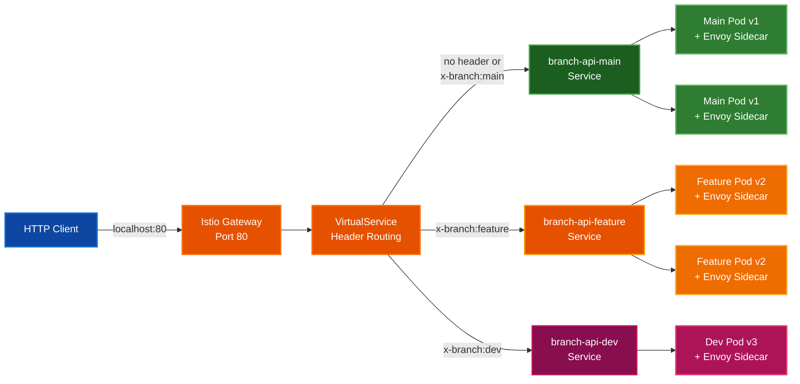

# Side-by-Side Deployment Demo

Kubernetes demo showcasing advanced traffic management with Istio service mesh and Helm. Route traffic to different API versions using custom HTTP headers - perfect for demonstrating canary deployments, A/B testing, and blue-green strategies.

## 🚀 Quick Start

```powershell
.\deploy.ps1
```

This script automatically:
1. Checks/installs dependencies (kind, helm, Istio)
2. Creates local Kubernetes cluster
3. Installs Istio service mesh with ingress gateway
4. Builds .NET 8 API container
5. Deploys 3 versions with Helm
6. Tests all routing scenarios

## 🧪 Test Header-Based Routing

```powershell
# Default (no header) → routes to main (v1.0.0)
Invoke-RestMethod http://localhost/api/info

# Custom header routing
Invoke-RestMethod http://localhost/api/info -Headers @{"x-branch"="feature"}  # v2.0.0-beta
Invoke-RestMethod http://localhost/api/info -Headers @{"x-branch"="dev"}      # v3.0.0-alpha
Invoke-RestMethod http://localhost/api/info -Headers @{"x-branch"="main"}     # v1.0.0
```

## 📊 Visualize Traffic with Kiali

```powershell
kubectl port-forward -n istio-system svc/kiali 20001:20001
# Open http://localhost:20001 (username: admin, no password)
```

View real-time service mesh topology, traffic flow, and metrics.

## ⚙️ Customize Deployment

Edit [charts/sbs-demo/values.yaml](charts/sbs-demo/values.yaml):

```yaml
branches:
  main:
    replicas: 2              # Scale deployments
    version: v1              # Change version labels
    env:
      version: "1.0.0"       # Set environment variables

  feature:
    enabled: true            # Enable/disable branches
    headerValue: feature     # Custom header value
    replicas: 2
```

Add more branches by copying the pattern - no limit on routing rules.

## 📦 Manual Helm Commands

```powershell
# Install/upgrade
helm upgrade --install sbs-demo ./charts/sbs-demo --create-namespace

# View values
helm get values sbs-demo -n sbs-demo

# Uninstall
helm uninstall sbs-demo -n sbs-demo
```

## 🏗️ Architecture

**Stack:**
- **.NET 8** - Minimal API with health checks
- **Docker** - Multi-stage builds for optimized images
- **Kubernetes (kind)** - Local cluster for development
- **Istio 1.20** - Service mesh with automatic sidecar injection
- **Helm 3** - Package management and templating

**Traffic Flow:**



**Istio Resources:**
- **Gateway**: Exposes port 80 on localhost
- **VirtualService**: Matches `x-branch` header values to route traffic
- **DestinationRule**: Defines service subsets (v1, v2, v3) based on pod labels

**Benefits:**
- ✅ Unlimited routing rules (no canary limitations)
- ✅ mTLS encryption between services
- ✅ Traffic visualization with Kiali
- ✅ Circuit breaking and retry logic
- ✅ Request tracing and metrics

## 🧹 Cleanup

```powershell
# Run cleanup script (prompts for confirmation)
.\cleanup.ps1

# Or manually delete cluster
kind delete cluster --name sbs-demo
```

## 📋 Requirements

- **Docker Desktop** (running)
- **kubectl** ([install](https://kubernetes.io/docs/tasks/tools/install-kubectl-windows/))
- **PowerShell** 5.1+

*Script auto-installs: kind, helm, Istio*

## 📁 Project Structure

```
├── deploy.ps1                    # One-command automation
├── cleanup.ps1                   # Cleanup and remove cluster
├── src/BranchApi/
│   ├── Program.cs                # .NET 8 Minimal API
│   └── BranchApi.csproj
├── charts/sbs-demo/              # Helm chart
│   ├── Chart.yaml
│   ├── values.yaml               # Configuration
│   └── templates/
│       ├── deployment.yaml       # 3 versioned deployments
│       ├── service.yaml          # ClusterIP services
│       ├── namespace.yaml        # Istio injection enabled
│       ├── gateway.yaml          # Istio ingress
│       ├── virtualservice.yaml   # Header routing rules
│       └── destinationrule.yaml  # Service subsets
└── Dockerfile                    # Multi-stage build
```

## 🎯 Use Cases

- **Canary Deployments**: Route small percentage of traffic to new versions
- **A/B Testing**: Split traffic based on user attributes
- **Feature Flags**: Enable features for specific users via headers
- **Blue-Green**: Switch traffic between versions instantly
- **Developer Routing**: Route dev traffic to personal branches
